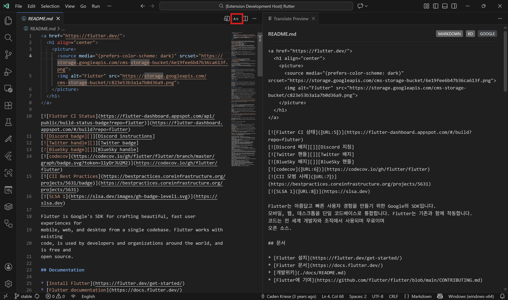

# VS Code Translate Panel

Real-time translation preview panel for any text-based file in VS Code.




## Features

- **Side-by-Side Preview**: Open a dedicated panel to view translated content alongside your original file
- **Smart Translation**:
  - Code files (`.cs`, `.java`, `.ts`, `.py`, etc.): Only comments are translated, code stays intact
  - Markdown: Code blocks and inline code preserved, text translated
  - Plain text: Full translation
- **Real-time Sync**: Updates automatically on save or as you type
- **Free Translation Engines**: Google Translate (unofficial) and Gemini API support
- **20+ Languages Supported**: C#, Java, JavaScript, TypeScript, Python, Go, Rust, and more

## Usage

1. Open any file
2. Click the **A文** icon in the editor title bar (top-right)
3. Or use Command Palette: `Ctrl+Shift+P` → `Translate Panel: Open Preview`

## Configuration

| Setting | Default | Description |
|---------|---------|-------------|
| `translatePanel.targetLanguage` | System language | Target language code (`ko`, `en`, `ja`, `zh`, `es`, etc.) |
| `translatePanel.translationEngine` | `google` | Translation engine: `google` or `gemini` |
| `translatePanel.updateMode` | `onSave` | Update trigger: `onSave` or `onType` |
| `translatePanel.geminiApiKey` | - | API key for Gemini engine |
| `translatePanel.debounceDelay` | `500` | Delay in ms for `onType` mode |

## Supported Languages

### Code Files (Comments Only)
C#, Java, JavaScript, TypeScript, Python, Go, Rust, Swift, Kotlin, C/C++, Ruby, PHP, Lua, SQL, Shell, PowerShell, and more.

### Content Files (Smart Protection)
- **Markdown**: Translates text, preserves code blocks, inline code, URLs
- **JSON**: Translates string values, preserves keys and structure
- **HTML**: Translates text content, preserves tags, scripts, styles

## Examples

### C# File
```csharp
public class Example
{
    // This comment will be translated → 이 주석은 번역됩니다
    public void Method() { }
}
```

### Markdown File
```markdown
# Title → 제목
This text is translated. → 이 텍스트는 번역됩니다.
`code stays as is` → `code stays as is`
```

## Requirements

- VS Code 1.85.0 or higher
- Internet connection for translation API
- Gemini API key (optional, for Gemini engine)

## Disclaimer

This extension uses unofficial Google Translate API for the default engine. For heavy usage, consider using the Gemini API with your own key.

## License

MIT License - see [LICENSE](LICENSE) for details.
